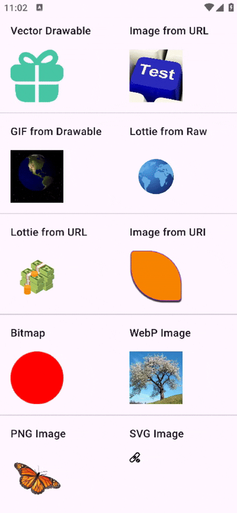

# 🖼️ Loadify - The Ultimate Image Loading Library for Jetpack Compose



**Loadify** is a lightweight, powerful image loading library built natively in Kotlin for Jetpack Compose.  
It supports all modern image types—GIF, SVG, WebP, Vector, Bitmap, Lottie—and offers unmatched performance and customization with zero dependencies like Coil, Picasso, or Glide.

---

## 🚀 Features

✅ Load from **URL**, **Drawable**, **Bitmap**, **Uri**  
✅ Full support for **GIFs** (via `AnimatedImageDrawable`)  
✅ Render **SVGs**, **WebP**, **Vector Drawables**  
✅ Play **Lottie Animations** (from raw res or remote URL)  
✅ **Built-in Caching**: memory & disk  
✅ **Image Transformations**: Circle Crop, Blur  
✅ Customize **headers**, **placeholders**, and **error states**  
✅ Full **loading state lifecycle**: `onLoading`, `onSuccess`, `onError`  
✅ **MIT Licensed** & **100% Kotlin**

---

## 📦 Installation (Maven Central)

```kotlin
// build.gradle (Kotlin DSL)
dependencies {
    implementation("com.quadlogixs.loadify:loadify:0.1.0")
}

repositories {
    mavenCentral()
}
```

---

## 🧪 Usage

```kotlin
Loadify(
    data = "https://example.com/image.jpg",
    modifier = Modifier.size(100.dp),
    placeholder = { CircularProgressIndicator() },
    onLoadSuccess = { println("Loaded!") },
    onLoadError = { println("Failed") }
)
```

---

## 🧩 Supported Formats

| Format         | Source                | ✅ Supported |
|----------------|------------------------|--------------|
| PNG, JPG, BMP  | URL, Drawable          | ✅           |
| WebP           | URL, Drawable          | ✅           |
| SVG            | URL                    | ✅           |
| GIF            | URL, Drawable          | ✅           |
| Lottie JSON    | RawRes, URL            | ✅           |
| Bitmap         | Instance               | ✅           |
| Uri            | From content picker    | ✅           |

---

## ✨ Advanced Options

```kotlin
Loadify(
    data = "https://example.com/image.webp",
    modifier = Modifier.size(120.dp),
    circleCrop = true,
    blurRadius = 10,
    colorFilter = ColorFilter.tint(Color.Red),
    headers = mapOf("Authorization" to "Bearer token123"),
    contentScale = ContentScale.Fit,
    onLoading = { /* show loader */ },
    onLoadSuccess = { /* success */ },
    onLoadError = { /* error */ },
    lottieOptions = LottieOptions(
        isPlaying = true,
        iterations = LottieConstants.IterateForever,
        speed = 1.2f,
        renderMode = RenderMode.AUTOMATIC
    )
)
```

---

## 🎞️ Format-Specific Examples

### 🖼 Vector Drawable

```kotlin
Loadify(data = R.drawable.ic_vector)
```

### 🎞 GIF (from drawable or URL)

```kotlin
Loadify(data = R.drawable.animated_gif)
Loadify(data = "https://example.com/cat.gif")
```

### 🎨 SVG

```kotlin
Loadify(data = "https://example.com/image.svg")
```

### 🎬 Lottie Animation

```kotlin
Loadify(data = R.raw.loading_animation)

Loadify(data = "https://example.com/lottie.json")
```

### 📷 From Uri (image picker)

```kotlin
Loadify(data = selectedImageUri)
```

---

## 📸 Sample Gallery

- ✔️ Vector Drawable
- ✔️ WebP
- ✔️ Lottie (Raw & URL)
- ✔️ GIF (Drawable & Remote)
- ✔️ Bitmap
- ✔️ URI (Picker)
- ✔️ SVG from Web
- ✔️ PNG / JPG

---

## 📂 Sample App

Run the sample project inside the `sample/` module to preview all features live.

---

## 📜 License

```
MIT License
Copyright (c) 2025 Kamran
```

---

## 🌍 Author

**Kamran (@kami-kamran)**  
🔗 [GitHub](https://github.com/kami-kamran)  
📧 mkami.kamran786@gmail.com

---

## ⭐️ Show some love

If you like Loadify, consider giving it a ⭐️ on GitHub — it helps more devs discover modern, dependency-free Compose tools!